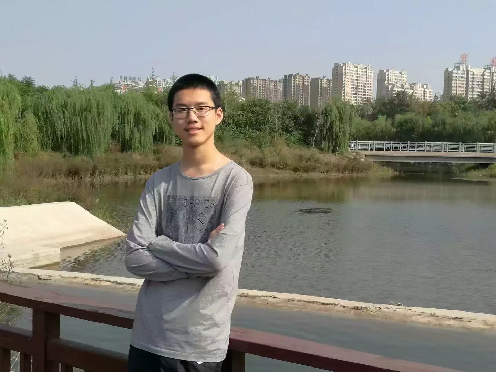

class: center, middle

# 自我介绍

&nbsp;
&nbsp;

#### 张泽岳(2607718149@pku.edu.cn)  

主页: https://github.com/zhangzeyue1999

---

## 自我介绍

### 1. 基本信息

#### &nbsp; &nbsp; 1.1 姓名、身份
#### &nbsp; &nbsp; 1.2 学习经历
#### &nbsp; &nbsp; 1.3 兴趣爱好

### 2. 个人照片

### 3. 联系方式

---

## 基本信息

### 1.1姓名和身份
       姓名：张泽岳   出生年月：1999.01
       身份：北京大学化学与分子工程学院2017级本科生

### 1.2学习经历：
                 2011.9-2014.7 大连市第三十九中学
                 2014.9-2017.6 大连市第二十四中学
                 2017.9-至今 北京大学化学与分子工程学院

### 1.3兴趣爱好：
                 化学、历史、地理、文化、桌游、旅游等

---

## 自我介绍

### 1. 基本信息

#### &nbsp; &nbsp; 1.1 姓名、身份
#### &nbsp; &nbsp; 1.2 学习经历
#### &nbsp; &nbsp; 1.3 兴趣爱好

### 2. 个人照片

### 3. 联系方式

---

## 个人照片

** 张泽岳 **

---

## 自我介绍

### 1. 基本信息

#### &nbsp; &nbsp; 1.1 姓名、身份
#### &nbsp; &nbsp; 1.2 学习经历
#### &nbsp; &nbsp; 1.3 兴趣爱好

### 2. 个人照片

### 3. 联系方式

---

## 联系方式

###QQ：2607718149

###邮箱：2607718149@pku.edu.cn

---

class: center, middle

# 谢谢
